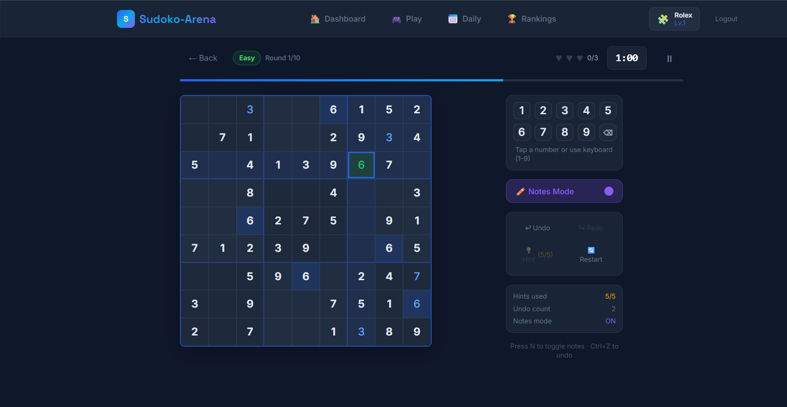
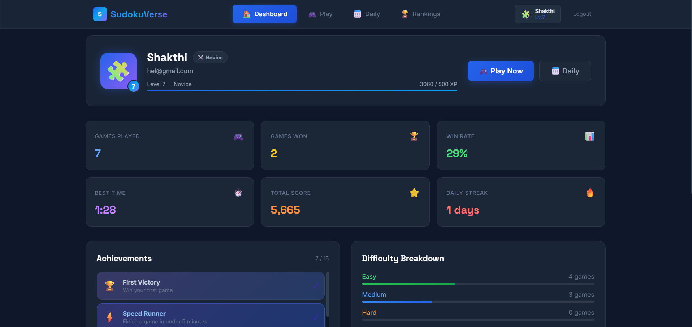
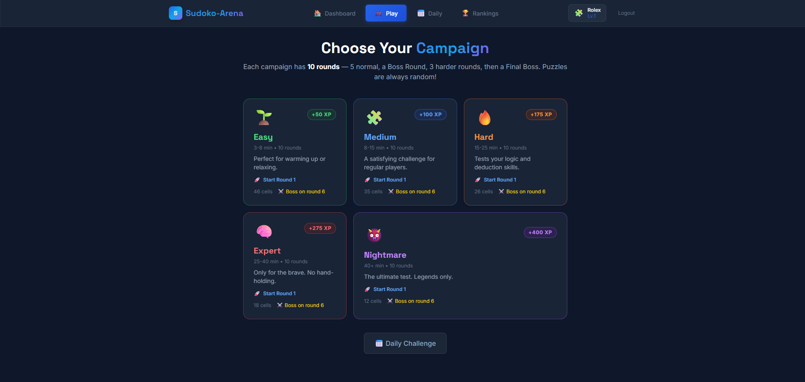
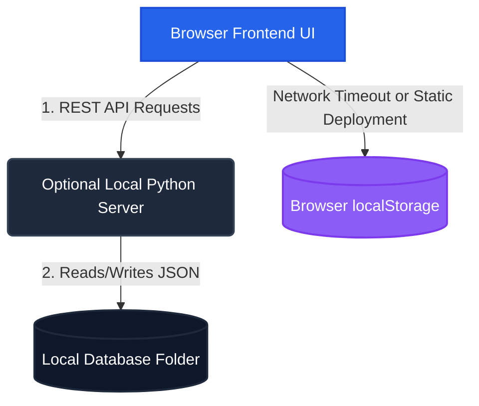

# 🧩 Sudoko-Arena

> A premium, local-first Sudoku platform featuring notes mode, smart solver-backed hints, daily challenges, a multi-phase campaign progression system, and local statistics tracking. 

[](LICENSE)
[](https://python.org)
[](https://react.dev)
[](https://tailwindcss.com)
[](CONTRIBUTING.md)

---

## 📌 Current Project Status

> [!IMPORTANT]
> **This version is a frontend-focused implementation designed for gameplay demonstration and portfolio purposes. Backend services and centralized database synchronization are planned for future versions.**
>
> The project functions as an **offline-first application**. It stores user credentials, gameplay progression, achievements, and leaderboard results locally in the user's browser, with support for local file-based data backup if running the optional Python development server.

---

## 📝 Project Description

Sudoko-Arena delivers a polished, modern, and visually stunning Sudoku gameplay experience. Using a sleek dark glassmorphism layout, it challenges players with daily puzzles, level-up milestones, and a narrative campaign progression culminating in boss rounds. 

The application is engineered to operate seamlessly without the internet, falling back gracefully to client-side browser storage if no server is present. For developers, recruiters, or portfolio reviewers, it also includes a lightweight local Python REST API server to simulate file-based database persistence.

---

## ⚡ Live Demo

The application can be compiled to static assets and deployed to hosting providers like **Netlify** or **GitHub Pages**. 

* **Live Demo URL:** [https://suduko-arena.netlify.app/](https://suduko-arena.netlify.app/)
* **Offline Ready:** Simply load the URL once, and the entire game remains fully playable even when disconnected from the network.

---

## ✨ Features

### 🎮 Gameplay System
- **Dynamic Board Generation:** Generates valid, unique Sudoku puzzles on the fly across multiple difficulties (Easy, Medium, Hard, Expert).
- **Solver-Backed Smart Hints:** Provides interactive hints that don't just solve cells, but explain the exact logical backtracking steps to find the correct number.
- **Pencil Notes Mode:** Toggle note-taking for individual cells to keep track of candidates.
- **Move History:** Full support for Undo, Redo, and board restart.
- **Game Rules Configuration:** Standard game mode with mistake limits (up to 3 strikes before failure).

### 🏆 Daily Challenges & Campaign
- **Daily Challenge Mode:** One dedicated daily puzzle available per user, updated once every 24 hours.
- **Campaign Progression:** A structured sequence of levels (e.g., Easy, Medium, Hard, and Expert phases) containing multiple rounds, ending in intense boss fights.
- **Resume Progress:** Active board states, note grids, timers, and campaign configurations are saved so games can be resumed at any time.

### 📈 Stats, Achievements, & Leaderboard
- **XP & Levels:** Earn experience points by successfully solving puzzles. Higher difficulty and faster times earn more XP, allowing users to level up.
- **Rank Titles:** Progress through skill ranks from *Novice* to *Grandmaster* based on total XP.
- **Local Achievements:** Unlock badges for specific milestones, such as completing your first game, finishing without using hints, or winning a campaign boss round.
- **Leaderboard Standings:** Displays a list of top scores, times, and levels.

### 🔐 Offline-First Authentication
- **Local Accounts:** Create credentials and log in. In offline mode, password validation and profiles are processed client-side.

---

## 📸 Screenshots

| 🎮 Active Board | 📊 Dashboard |
|:---:|:---:|
|  |  |

| 🗺️ Campaign Map |
|:---:|
|  |

*Additional screenshot assets can be found in the [screenshots/](screenshots) folder, covering the [Result Screen](screenshots/Result.png), [Leaderboard Rankings](screenshots/leaderboard.png), and [Login Forms](screenshots/login.png).*

---

## 🛠️ Technology Stack

### Frontend (Client-Side)
- **Core Framework:** React 18 (loaded via CDN)
- **JSX Compilation:** Babel Standalone (compiled directly in the browser)
- **Styling:** Vanilla CSS & Tailwind CSS v3 (loaded via CDN) for responsive utility design
- **Typography:** Space Grotesk (for headers) and Inter (for interface/body text) from Google Fonts
- **State Management:** React Reactivity (`useState`, `useRef`, `useEffect`)

### Local Development Server (Optional Backend)
- **Language & Runtime:** Python 3.10+
- **HTTP Engine:** Python Standard Library (`http.server` & `BaseHTTPRequestHandler`)
- **Password Security:** `bcrypt` for hashing and authentication checks
- **Configuration:** `python-dotenv` for loading project environment variables

### Persistence Layer
- **Default Production / Static Deploy:** Web browser `localStorage` API
- **Local Server Development:** JSON flat files saved inside `database/` (`users/`, `games/`, and `leaderboard.json`)

---

## 🏗️ Project Architecture

Sudoko-Arena operates under a dual-architecture paradigm depending on how it is accessed:



### Modes of Operation:
1. **Static / Offline Mode (e.g., Netlify Deploy):** The frontend attempts to ping the local REST server endpoint. If it receives a network error (or is hosted on a static server), it transitions silently to client-side mode. All registrations, updates, game saves, and leaderboards read/write directly to the browser's local storage.
2. **Local Python API Server:** Running the Python handler locally activates server mode. The frontend redirects API requests to `http://127.0.0.1:8888`. The server processes API calls and persists records inside standard JSON flat files on the host computer.

---

## 🗄️ Local Storage Implementation Details

When running offline, the browser's `localStorage` is used to persist data. The following keys are managed:

| Key Name | Data Type | Description |
|:---|:---|:---|
| `sv_user` | `Object` | The active session profile information (username, avatar, XP, level, rank). |
| `sv_accounts` | `Object` | Map of all locally registered users keyed by UUID. Stores profile details and password hashes for validation. |
| `sv_game` | `Object` | The saved active game state. Tracks cell values, pencil notes, mistake count, timer, and campaign variables. |
| `sv_leaderboard` | `Array` | A collection of score records sorted by level and total points for ranking display. |
| `sv_retry_puzzle` | `Object` | Caches the configuration and solution of the last failed board to allow a retry on the same grid. |
| `sv_last_result` | `Object` | Details of the most recently finished game, used to render the game summary views. |
| `sv_daily_done_[userId]_[YYYY-MM-DD]` | `Object` | Verification token marking daily challenge completion for the active user. |

---

## 📦 Installation Guide

### Prerequisites
- **Python 3.10+** (Required only for running the local backend server)
- **Node.js >= 18.0.0** (Required only for running the static frontend bundler/previewer)

---

## 🔧 Local Development Setup

1. **Clone the Repository:**
   ```bash
   git clone https://github.com/shakthicode/Sudoko-Arena.git
   cd Sudoko-Arena
   ```

2. **Configure Environment Variables:**
   Create a local `.env` configuration from the provided template:
   - On Windows:
     ```cmd
     copy .env.example .env
     ```
   - On macOS/Linux:
     ```bash
     cp .env.example .env
     ```
   *(Optional)* Customize the environment variables inside [.env](.env):
   ```env
   PORT=8888
   ```

3. **Install Dependencies:**
   Install required Python packages for hashing and environment loading:
   ```bash
   pip install -r requirements.txt
   ```

---

## 🚀 Running the Project

### Windows (Quick Launch - Recommended)
Simply double-click the **`run.bat`** launcher script in the root directory. 
The script automatically:
- Validates that Python 3.10+ is installed on your PATH.
- Creates an isolated Python virtual environment (`.venv`) if it does not exist.
- Performs a silent verification and installs dependencies from `requirements.txt` if needed.
- Resolves server port availability.
- Starts the local Python REST server in the foreground.
- Opens your default web browser to `http://127.0.0.1:8888`.

To stop the application, return to the CMD window running the server and press `Ctrl+C`.

### Manual Startup (Any OS)
If you are on macOS/Linux or prefer manual execution, start the local server in your terminal:
```bash
python backend/server.py
```
Then navigate to `http://127.0.0.1:8888` in your web browser.

---

## 🛠️ Build and Deployment Instructions

### Local Static Build
To compile the single-page application into the `dist/` directory for static hosting:
```bash
# Install node packages (creates setup context)
npm install

# Run the build script
npm run build
```
This runs [scripts/build.js](scripts/build.js) (or you can manually execute `python scripts/build.py`). The script copies `index.html` to `dist/index.html` and automatically writes a `_redirects` file to enable clean routing under Single-Page Application (SPA) configurations.

### Preview Static Build Locally
To test the built static files locally using Python's standard web server:
```bash
npm run preview
```
This serves the compiled assets directly out of the `dist/` folder on port `8888`.

### Cloud Deployment (Netlify)
This repository is configured out-of-the-box for deployment on **Netlify**. 
- **Build Command:** `npm run build`
- **Publish Directory:** `dist`
- **Routing Rules:** Handled automatically via [netlify.toml](netlify.toml) and the generated `dist/_redirects` file.

---

## 📂 Project Folder Structure

```text
Sudoko-Arena/
├── backend/                      # Python local REST API server
│   ├── server.py                 # Request handlers, routes, and password validation
│   └── schema.sql                # PostgreSQL SQL schema reference (migration roadmap)
├── database/                     # Local JSON flat-file storage directory (Git-ignored)
│   ├── users/                    # User account profiles (keyed by UUID)
│   ├── games/                    # Saved match histories and states
│   └── leaderboard.json          # Cached leaderboard rankings
├── docs/                         # Extended project documentation
│   ├── api-documentation.md      # Local REST API endpoints reference
│   ├── architecture.md           # Visual breakdown of the component layers
│   ├── database-design.md        # Detailed JSON schemes for local storage
│   └── launcher-documentation.md # Troubleshooting guide for the run.bat launcher
├── frontend/                     # Frontend client codebase
│   └── index.html                # Single-page interface (React, Tailwind, Babel CDN)
├── logs/                         # Application runtime logs (Git-ignored)
├── screenshots/                  # Graphic assets for README visualization
├── tests/                        # Automated regression test suite
│   └── test_server.py            # Unit + integration test files (18 automated tests)
├── .env.example                  # Template configuration file for variables
├── .gitignore                    # Prevents credentials, database, logs, and venv from committing
├── CONTRIBUTING.md               # Guidelines for developers joining the codebase
├── LICENSE                       # MIT licensing terms
├── package.json                  # Scripts configuration for Node tasks
├── requirements.txt              # Python requirements (bcrypt, python-dotenv)
└── run.bat                       # CMD launcher tool for Windows systems
```

---

## 🧪 Testing

The local server code is covered by a suite of 18 unit and integration tests. Run the test pipeline using:
```bash
python -m pytest tests/ -v
```

---

## ⚠️ Current Limitations

Please keep the following constraints in mind when testing or evaluating this project:
* **Browser Sandbox Storage:** In static/offline mode, user profiles, game history, and progress are stored exclusively within the browser's `localStorage` sandbox.
* **Clearing Browser Data Resets Game Progress:** Clearing cookies, history, or site data on your browser will delete all local accounts, levels, records, and active streaks.
* **Device & Browser Isolation:** User accounts are device- and browser-specific. An account registered in Chrome on your laptop will not be accessible in Firefox on the same laptop or on your mobile device.
* **No Real-Time Cloud Sync:** The application behaves as a local-first system. There is no central server database hosting, cloud synchronization, or online multiplayer lobby.

---

## 🔮 Future Improvements

We plan to implement the following features in upcoming versions of the project:
1. **Production Relational Database:** Transition storage from JSON flat files and local storage to a robust relational database layer (e.g., PostgreSQL or SQLite).
2. **Centralized Backend Service:** Build a production-grade cloud API (using Django, FastAPI, or Spring Boot) to replace the lightweight Python server script.
3. **Cloud Authentication:** Implement secure, centralized user sessions with JWT (JSON Web Tokens) or OAuth2 providers.
4. **Cross-Device Account Sync:** Synchronize player stats, XP, and campaign progress across multiple devices.
5. **Real-time Global Leaderboards:** Allow players to compete on a global live leaderboard.

---

## 🤝 Contribution Guidelines

Contributions are welcome! Please refer to the [CONTRIBUTING.md](CONTRIBUTING.md) guide before opening a pull request.
- Ensure all Python modifications follow **PEP 8** formatting.
- Verify that changes do not break the offline fallback functionality in `frontend/index.html`.
- Run the regression test suite (`python -m pytest tests/ -v`) before committing code.

---

## 📄 License

This project is licensed under the terms of the MIT License. See the [LICENSE](LICENSE) file for details.

---

## 👤 Author Information

- **Developer:** [shakthicode](https://github.com/shakthicode)
- **Repository:** [Sudoko-Arena](https://github.com/shakthicode/Sudoko-Arena)
# Sudoko-Arena
# Sudoko-Arena
