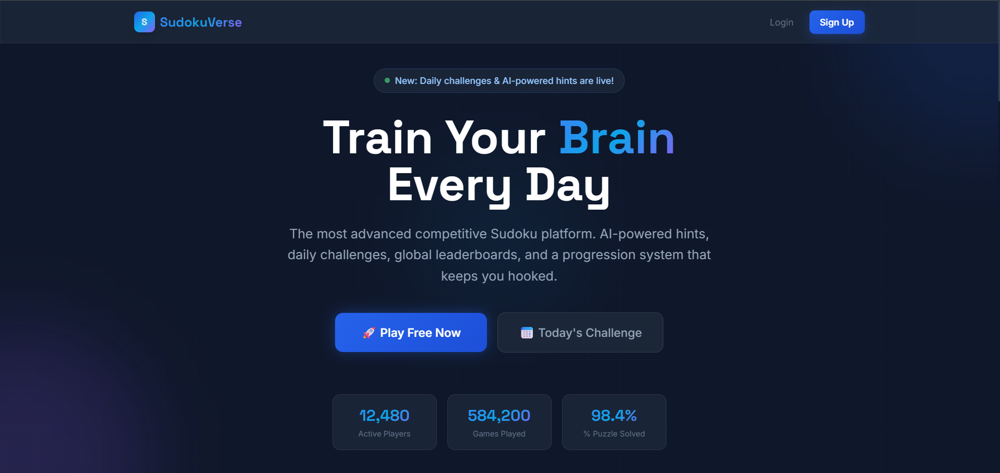
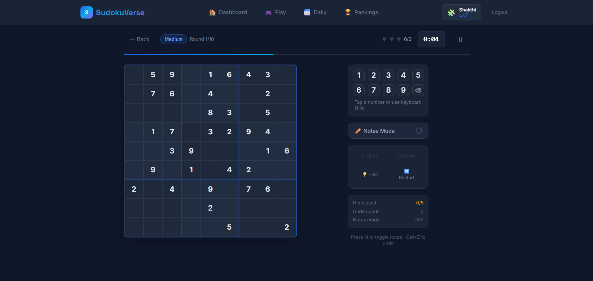
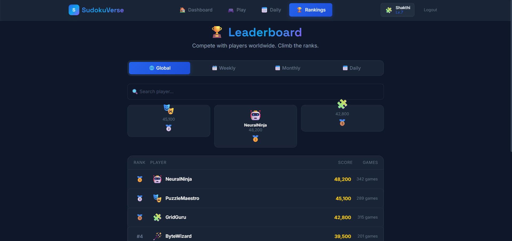
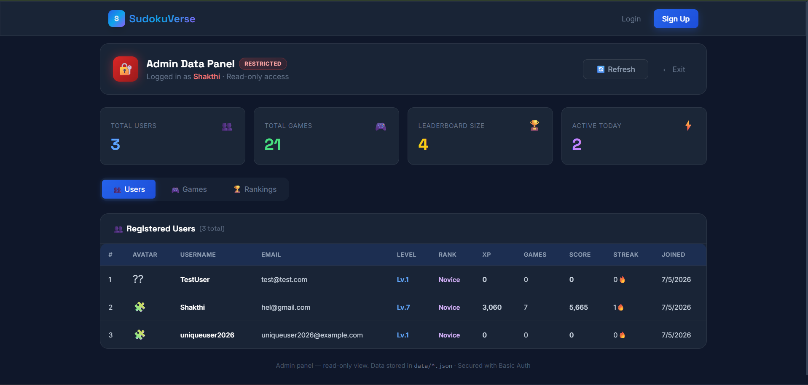
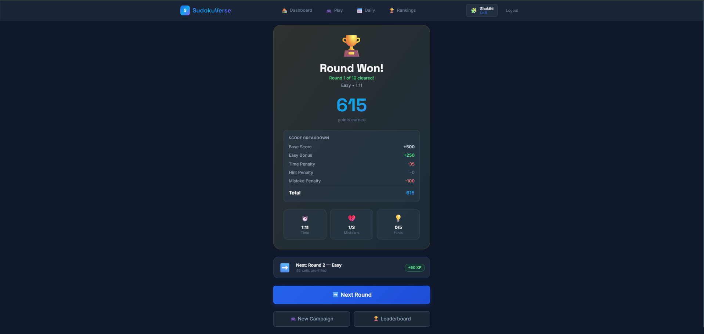
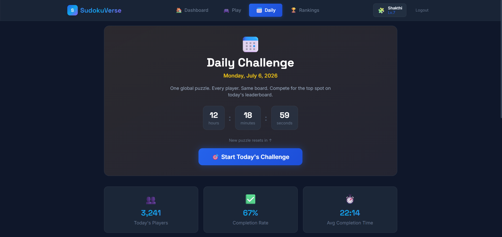
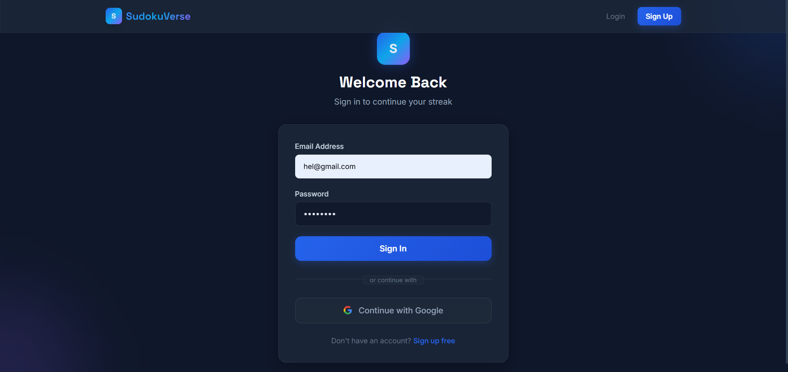

# 🧩 Sudoko-Arena

> A modern, full-stack competitive Sudoku platform — featuring algorithmically generated puzzles, AI-powered Smart Hints, daily challenges, a global leaderboard, achievement unlocks, campaign mode, and a secure bcrypt-authenticated REST API backend. Built as an end-to-end portfolio demonstration.

[](LICENSE)
[](https://python.org)
[](https://react.dev)
[](https://tailwindcss.com)
[](https://pypi.org/project/bcrypt/)

---

## 📸 Screenshots

| 🏠 Landing Page | 📊 User Dashboard | 🎮 Live Gameplay |
| :---: | :---: | :---: |
|  |  |  |

| 🏆 Leaderboard | 🛡️ Admin Panel | 🎯 Game Results |
| :---: | :---: | :---: |
|  |  |  |

| 📅 Daily Challenge | 🔐 Authentication |
| :---: | :---: |
|  |  |

---

## ✨ Features

| Feature | Description |
|---------|-------------|
| 🧩 **Backtracking Puzzle Generator** | Unique, algorithm-generated puzzles with single-solution guarantee across 5 difficulties |
| 🤖 **AI Smart Hints** | Context-aware logical explanations (row/col/box elimination, naked singles) for every move |
| 📅 **Seeded Daily Challenges** | Deterministic daily puzzles shared globally using `mulberry32` PRNG seeded by date |
| 📈 **XP & Level Progression** | Earn XP per win; progress through 7 ranks from Novice to Grandmaster |
| 🏆 **Global Leaderboard** | Real-time ranking updates persisted to `database/leaderboard.json` after every win |
| 🎖️ **15 Unique Achievements** | Unlock badges for speed, perfectionism, streaks, and difficulty milestones |
| 🔥 **Daily Streak Tracker** | Calendar heatmap tracking consecutive login days; breaks on missed days |
| 🎮 **Campaign Mode** | 10-round progression per difficulty with escalating bosses and level transitions |
| ♟️ **Notes Mode** | Candidate notation support (pencil marks) in a 3×3 sub-grid inside each cell |
| 🔄 **Undo System** | Unlimited move history with full board-state rollback |
| 🔒 **bcrypt Authentication** | Cryptographic password hashing with SHA-256 legacy migration on first login |
| 🛡️ **Admin Dashboard** | HTTP Basic Auth–protected panel for user management and data inspection |
| 📱 **Responsive Design** | Mobile-optimized layout with touch-target sizing and adaptive grid scaling |
| 🌙 **Dark Mode UI** | Premium glassmorphism dark theme with animated gradient orbs and particle effects |

---

## 🛠️ Tech Stack

### Frontend
| Technology | Purpose |
|-----------|---------|
| **React 18** (CDN, production build) | Component rendering and reactive state via hooks |
| **TailwindCSS v3** (CDN) | Utility-first responsive design system |
| **Babel Standalone** | In-browser JSX transpilation |
| **Space Grotesk & Inter** (Google Fonts) | Premium display and body typography |
| Custom CSS + Animations | Glassmorphism cards, gradient orbs, keyframe animations |

### Backend
| Technology | Purpose |
|-----------|---------|
| **Python 3 `http.server`** | Custom REST API extending `BaseHTTPRequestHandler` |
| **`bcrypt`** | Industry-standard cryptographic password hashing |
| **`python-dotenv`** | Environment variable loading from `.env` |
| **`threading.Lock`** | Thread-safe mutexes preventing JSON write race conditions |
| **`uuid`** | Secure random session token generation |

### Storage
| Storage | Description |
|---------|-------------|
| `database/users/` | Per-user JSON profile files (`{uuid}.json`) |
| `database/games/` | Per-user game history JSON arrays |
| `database/leaderboard.json` | Global ranked leaderboard snapshot |

---

## 🏗️ Architecture

```
┌──────────────────────────────────────┐
│        React SPA (frontend/)         │  ← index.html served by Python server
│  React 18 + TailwindCSS + Babel JSX  │
└──────────────┬───────────────────────┘
               │  HTTP REST API calls
               ▼
┌──────────────────────────────────────┐
│   Python HTTP Server (backend/)      │  ← server.py (port 8888)
│   BaseHTTPRequestHandler + Lock      │
└──────────┬───────────────────────────┘
           │  Thread-safe JSON I/O
           ▼
┌──────────────────────────────────────┐
│   Local JSON Database (database/)    │
│  users/ · games/ · leaderboard.json  │
└──────────────────────────────────────┘
```

### Auth Flow
```
Register → bcrypt.hash(password) → write users/{id}.json
Login    → bcrypt.verify(password, hash) → issue UUID token → store in user file
Request  → Authorization: Bearer {token} → validate against stored token
Admin    → Authorization: Basic base64(user:pass) → validate against .env
```

---

## 🚀 Quick Start

### Prerequisites
- **Python 3.10+** added to your system `PATH`

### 1. Clone
```bash
git clone https://github.com/shakthicode/Sudoko-Arena.git
cd Sudoko-Arena
```

### 2. Configure
```bash
cp .env.example .env
```
Edit `.env` and set a secure admin password:
```env
PORT=8888
ADMIN_USERNAME=admin
ADMIN_PASSWORD=your_secure_password_here
```

### 3. Install Python Dependencies
```bash
pip install -r requirements.txt
```

### 4. Run

**Windows (one-click):**
```cmd
run.bat
```
The launcher automatically installs dependencies, starts the server, and opens your browser.

**All platforms (manual):**
```bash
python backend/server.py
```
Then open [http://localhost:8888](http://localhost:8888).

---

## 📡 API Reference

Full REST API documentation: [`docs/api-documentation.md`](docs/api-documentation.md)

| Method | Endpoint | Auth | Description |
|--------|----------|------|-------------|
| `POST` | `/api/auth/register` | None | Create a new user account |
| `POST` | `/api/auth/login` | None | Authenticate and receive session token |
| `POST` | `/api/users/update` | Bearer | Update user profile / progression |
| `GET` | `/api/users/{id}` | Bearer | Fetch user profile |
| `POST` | `/api/games/save` | Bearer | Save or update a game state |
| `GET` | `/api/games/{userId}` | Bearer | Retrieve user game history |
| `GET` | `/api/leaderboard` | None | Fetch global leaderboard |
| `POST` | `/api/leaderboard/update` | Bearer | Submit new leaderboard score |
| `GET` | `/api/admin/users` | Basic Auth | List all users (admin) |
| `DELETE` | `/api/admin/users/{id}` | Basic Auth | Delete a user (admin) |

---

## 📂 Project Structure

```
Sudoko-Arena/
│
├── frontend/               # React SPA (single-page application)
│   └── index.html          # Complete React app with JSX, Tailwind, and game engine
│
├── backend/                # Python REST API server + Spring Boot migration guide
│   ├── server.py           # BaseHTTPRequestHandler-based API (current)
│   ├── schema.sql          # PostgreSQL production schema (future)
│   └── README.md           # Spring Boot migration guide
│
├── database/               # Local JSON flat-file database (git-ignored)
│   ├── users/              # Per-user profile JSON files
│   ├── games/              # Per-user game history JSON files
│   └── leaderboard.json    # Global leaderboard snapshot
│
├── docs/                   # Technical documentation
│   ├── architecture.md     # System architecture & data flow diagrams
│   ├── api-documentation.md # Full REST API endpoint reference
│   └── database-design.md  # JSON schema + PostgreSQL migration strategy
│
├── screenshots/            # Application UI screenshots
├── tests/                  # Test directory (future unit/integration tests)
├── scripts/                # Utility scripts (future)
├── assets/                 # Static assets (future)
│
├── .env                    # Local configuration (git-ignored)
├── .env.example            # Configuration template
├── .gitignore              # Excludes database, logs, cache, secrets
├── CONTRIBUTING.md         # Contributor onboarding guide
├── LICENSE                 # MIT License
├── README.md               # Project documentation (this file)
├── requirements.txt        # Python dependencies (bcrypt, python-dotenv)
└── run.bat                 # Windows one-click launcher
```

---

## 🎮 Gameplay Guide

1. **Register** at the landing page → choose username + avatar emoji
2. **Select Difficulty** → Easy / Medium / Hard / Expert / Nightmare
3. **Play** → click a cell → enter a number (1-9) via keyboard or number pad
4. Use **Smart Hint** for a logical explanation of the correct move
5. Toggle **Notes Mode** to mark candidate numbers in a cell
6. Use **Undo** to reverse any move
7. Complete the board to earn **XP**, **achievements**, and **leaderboard ranking**
8. Return daily to maintain your **streak** and attempt the **Daily Challenge**

---

## 🗄️ Database & Migration

Current storage uses lightweight JSON flat files (zero external dependencies). For a production deployment, a complete PostgreSQL schema and Spring Boot migration guide is available:

- [`backend/schema.sql`](backend/schema.sql) — Full PostgreSQL DDL with indexes and constraints
- [`backend/README.md`](backend/README.md) — Spring Boot + JWT migration walkthrough
- [`docs/database-design.md`](docs/database-design.md) — Design rationale and data models

---

## 🔮 Future Roadmap

- [ ] **FastAPI / Spring Boot** — Migrate from `http.server` to a production-grade framework
- [ ] **PostgreSQL** — Replace flat-file JSON with a relational database
- [ ] **JWT Authentication** — Replace UUID tokens with signed JWTs (expiry + refresh)
- [ ] **WebSocket Multiplayer** — Real-time head-to-head Sudoku race mode
- [ ] **Docker Support** — Containerize for one-command deployment anywhere
- [ ] **CI/CD Pipeline** — GitHub Actions for linting, testing, and automated deployment
- [ ] **PWA / Mobile App** — Offline-capable Progressive Web App with service workers

---

## 🤝 Contributing

Contributions are welcome! See [`CONTRIBUTING.md`](CONTRIBUTING.md) for setup instructions, coding guidelines, and the pull request workflow.

---

## 📄 License

This project is licensed under the [MIT License](LICENSE).

---

## 👤 Author

**Anuvarshan M**

[](https://github.com/shakthicode)
[](https://linkedin.com/in/anuvarshan06)
