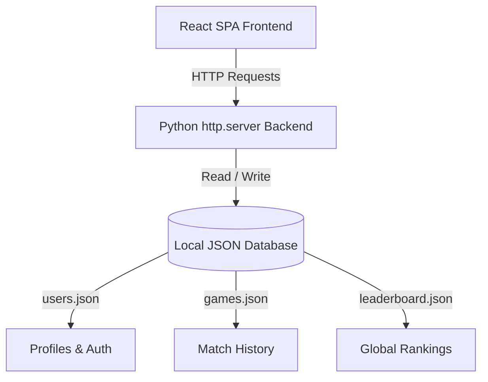
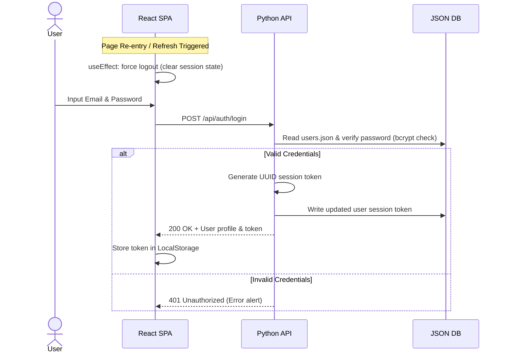
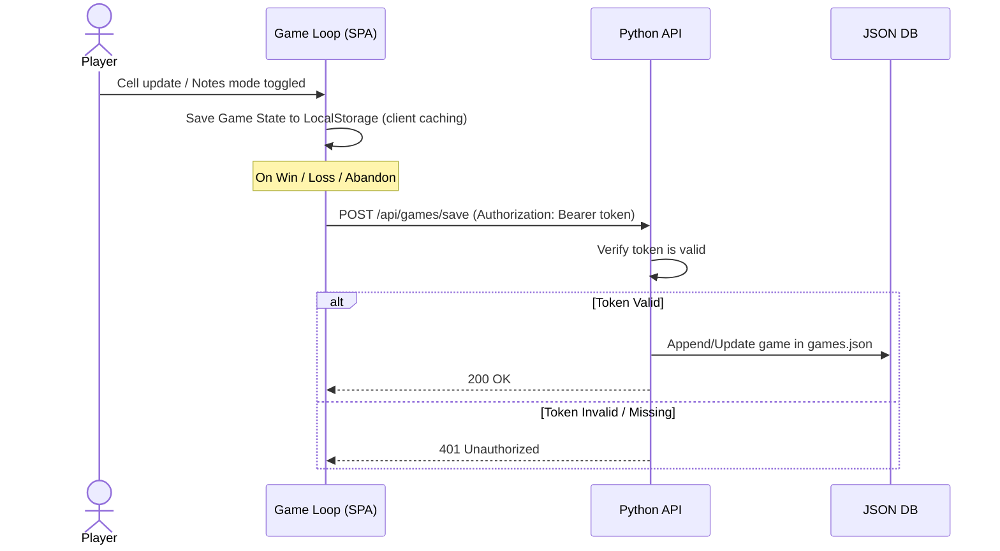
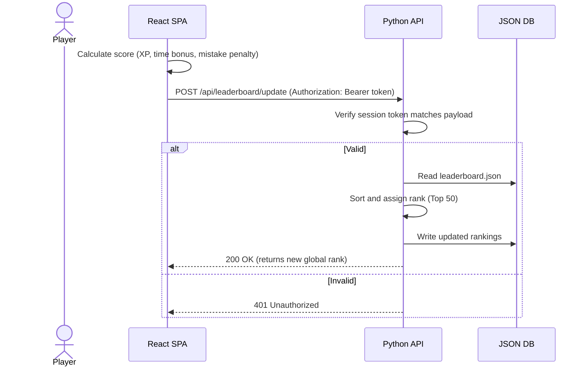

# 🏗️ System Architecture Documentation

This document describes the high-level architecture, flowcharts, and backend integrations of **Sudoko-Arena**.

---

## 🗺️ High-Level System Architecture

### 1. Frontend Layer
- **Technology Stack**: React 18, TailwindCSS CDN, Babel standalone parser, and Space Grotesk/Inter Google Fonts.
- **Engine Rules**: Custom algorithmic generator with backtracking solver to ensure single-solution boards across 5 difficulties: Easy, Medium, Hard, Expert, and Nightmare.
- **Routing**: Client-side state-based routing. Route guards protect paths `/dashboard`, `/game`, and `/results`.

### 2. Backend Layer
- **Technology Stack**: Single-threaded Python 3 HTTP REST engine built on `BaseHTTPRequestHandler`.
- **Database Persistence Layer**: Uses synchronized local JSON flat files using threading locks (`threading.Lock()`) to prevent race conditions during write/read operations.
- **Security Middleware**: Supports custom Basic HTTP Authentication validator for administrative routes and custom Bearer Token parser for standard API mutations.

---

## 🔄 Sequence Flows

### 1. Authentication & Auto-Logout Flow

### 2. Game Progress & Save Flow

### 3. Leaderboard Submission Flow

